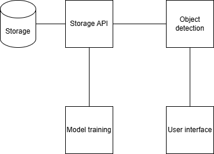

# Silkių atpažinimo prototipas.

# Architektūra
Projektui naudosime mikro servisų architektūrą. Štai galime matyti šios sistemos atskirus servisus:

Turime keturis pagrindinius servisus:
- Storage API - šis servisas turi prieigą prie duomenų bazės, bei failų talpyklos. Taip pat šis servisas parūpina "endpoints" duomenų rašymui bei gavimui Http requestų principu, kas leidžia kitiems servisams pasiekt saugoma informaciją.
- Model training - šis servisas atsakingas už modelio apmokymą, jis bendraudamas su talpyklos servisu gauna paveikslėlius bei jų "labels". Atlikus apmokymą šis siunčią modelį į talpyklą.
- Object detection - Iš talpyklos pasiėma visus galimus modelius, bei laukdamas užklausų iš vartotojo sąsajos atlieka objektų atpažinimą, o rezultatus siunčia atgal į vartotojo sąsają.
- User interface - vartotojo sąsaja leidžianti patogiai atpažinti silkes.

Kadangi turime gan skirtingus servisus, su skirtingais techniniais reikalavimais - talpyklos servisas reikalauja didelės atminties ir galingo procesoriaus, apmokymo ir atpažinimo servisai reikalauja galingos/ų vaizdo plokčių, bei vartotojo sąsąjos reikalauja padoraus procesoriaus, mikro servisų architektūrą leidžia tikslingai paskirstyti aparatūros resursus. Taip pat toks išskaidymas leidžia pasirinkti naudojamas technologijas pagal paskirtį (nebūtina viską parašyti viena programavimo kalba).

Talpyklos servisas atsakingas tiek už duomenų bazę kurioje saugoma informacija su įprastais duomenų tipais, tiek už modelių bei paveikslėlių talpyklas, kuriose saugomi dideli failai. Čia galime matyti duomenų bazės schemą:

Kaip matome ši duomenų bazė pagrinde atsakinga už paveikslėlių ir modelių tvarkymą. Paveikslėliai gali turėt daug jam priskirtų "labelių", kurių kiekvienas saugo informaciją apie "bounding box" kuriame yra objektas kurį siekiame atpažinti, jis užkoduojamas taip: klasės numeris (kadangi turime tik silkes, tai bus tik viena klasė, tačiau galima taip įvesti ir background klasė, kadangi ji reikalinga FasterRcnn modeliui, taip pat galima būtų įvest klasę "kitos žuvys", tokiu principu bandant apmokint modelį geriau išskirti silkes nuo kitų žuvų, nes apmokant tik ant silkių modelis gali visas žuvis atpažinti kaip silkes). Toliau turime keturis laukus stačiakampio užkodavimui, čia turime x ir y centro koordinates, bei w ir h, kurie atspindi stačiakampio plotį ir aukštį. Kiekvienas paveikslėlis gali priklausyti duomenų rinkiniui, šis rinkinio sudarymas leidžia patogiai paimti tam tikrus paveikslėlius, kadangi nevisuomet gali reikėti visų paveikslėlių, taip pat rinkinio elementui nustatome kuriam aibės tipui jis priklauso - treniravimo, testavimo ar validavimo, tai leidžia vygdant pakartotinį apmokymą, nesumaišyt duomenų ant kurių jau buvo atliktas apmokymas, bei visuomet turėt progą turėt duomenis kurie nebuvo įtraukti į apmokymo procesą, tam jog patikrint ar modelis gerai generalizuojasi su nematytais duomenim.

## Reiks sukurt klasių diagramą

# Technologijų pasirinkimas
Talpyklos servisui buvo pasirinkta dotnet technologija, kadangi tai yra gan populiari technologija kuriant API, taip pat ji yra padoriai naši ir projekto vystymas yra gan intuityvus ir tvarkingas dėl tipizuoto C# principo. Objektų atpažinimui ir mokymui buvo naudojama python progromavimo kalba, dėl jo didelio populiarumo dirbtinio intelekto sprendimuose, tad ir įrankių su šia kalba yra daugiausiai ir jie labai stipriai išvystyti. O vartotojo sąsajai buvo pasirinkta React su Typescript, Typescript šiuo atveju leidžia projektą padaryti tvarkingesnį įvedant tipus, o React buvo pasirinkta dėl turimos patirties su šia biblioteka, bei jos didelio populiarumo.

# Modelių apmokymas
Buvo bandyta apmokyti modelį tiek su Faster RCNN tiek su YOLO architektūromis. Faster RCNN pranašus tuo jog turi vieną iš didžiausių tikslumų, išlaikant padorų našumą, taip pat šis turi gerą dokumentaciją pytorch oficialioje dokumentacijoje, kuri leido pamatyti kaip duomenis galima paduoti pagal sukurtą architektūrą. Tačiau apmokyt jo nepavyko, dėl laiko trūkumo bandant įsigilint į patį mokymo procesą ir modelis nedavė tinkamų rezultatų. YOLO pagrindinis pranašumas yra jo greitis, šis puikiai tinka objektų atpažinimui realiu laiku, o tikslumas nedaug atsilieka nuo Faster RCNN architektūros. Pagrindinis trūkumas su kuriuo teko susidurt tai jog dokumentacija skirta tik nustatytui apmokymo būdui, kurio negalima pritaikyt pagal šio projekto sukurtą architektūrą. Tad apmokymas bus bandomas atlikt pagal jų nustatytą būdą, nepaisant sukurtos architektūros (dar vygdomas).

# Duomenys
Kadangi duomenų surinkimas gali būti ilgas ir brangus procesas, modelio apmokymui naudosime paruoštą "Roboflow" platformos rinkinį, kurį galime rasti čia: https://universe.roboflow.com/mitfisheryv3/herring-hf1ao/dataset/8.

# Modelio perspektyvos
atsisiuntus šį rinkinį buvo pastebėta jog treniravimo aibėje duomenys turi šiokių tokių nesklandumų - daugelyje paveikslėlių yra daug juodų atsitiktinių kvadratų. Šią problemą būtų galima spręsti pasitelkiant vaizdų užpildymo dirbtiniu intelektu, nors tai ir neatspindėtų pilnos teisybės, tačiau taip būtų ženkliai sumažinamas triukšmas.
Kadangi daugelis objektų atpažinimo modelių turi "backbone" tinklą kuris iš paveikslėlių ištraukia sąvybes taip pat būtų galima atskirai apmokint šį "backbone" tinklą skirtingų žuvų klasifikavimui, tai leistų modelį labiau pritaikyt sprendžiamai problemai.